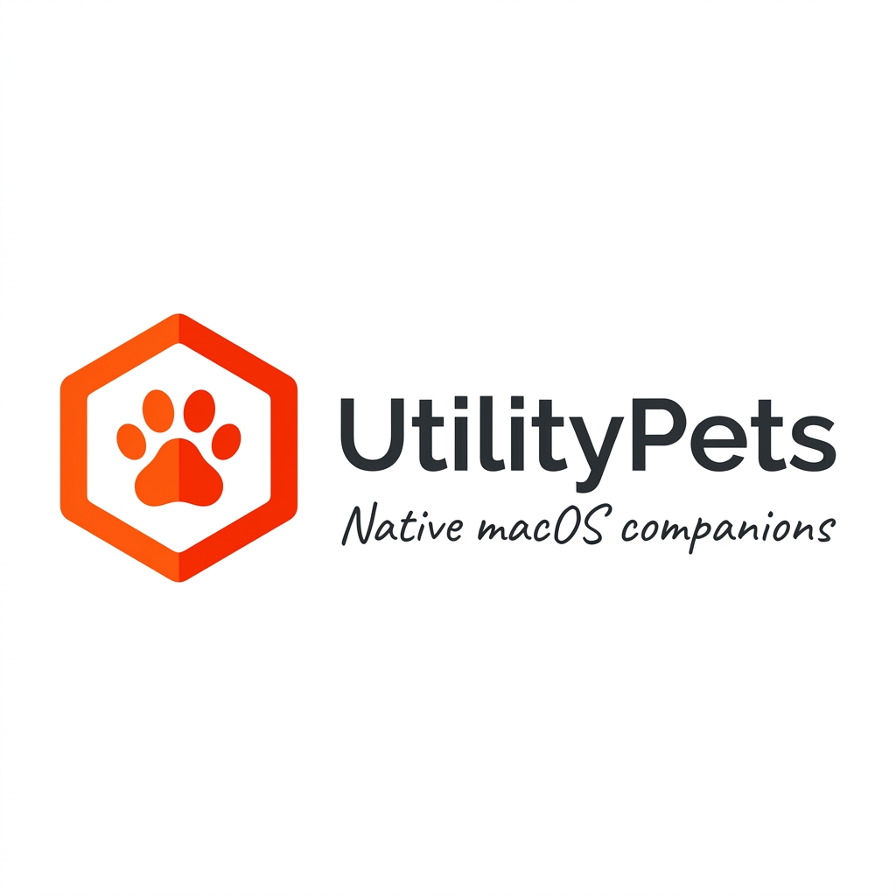

<p align="center">
  
</p>

# 🐾 Utility Pet — native macOS companions

> A native macOS host for small, focused utility pets. The first pet is **🐶 Casting Scooby**, a local-media casting companion.

## Project status

The native Utility Pet core follows the architecture plan: `App/UtilityPets` hosts the application, reusable modules live under `Packages/`, and individual pets live under `Pets/`. It provides the app host, menu-bar integration, a pet registry, event bus, and the first registered pet: **🐶 Casting Scooby**.

DLNA discovery, HTTP media streaming, and SOAP remote-control capabilities are fully implemented in Swift under `Packages/DeviceDiscovery` and `Pets/Scooby`.

Build & test the native app:

```bash
swift test
swift build
swift run UtilityPet
```

See [`docs/architecture.md`](docs/architecture.md) for the structure and pet-extension contract.

---

## ✨ Features

| Feature | Details |
|---------|---------|
| 🖱️ **Finder Quick Action** | Right-click any video → **Quick Actions** → **Cast with Scooby** |
| 🔍 **Native TV Discovery** | Scans your local network via SSDP/UPnP multicast in Swift |
| 📱 **Local HTTP Media Server** | Native Swift HTTP server streaming media over your LAN |
| ⏩ **HTTP Range Requests** | Smooth seeking and scrubbing on Smart TV via `206 Partial Content` |
| 🧪 **Swift Test Suite** | Comprehensive unit tests for PetCore and Scooby DLNA controls |
| 🔒 **Local-Only** | No internet connection required. No telemetry. No accounts. |

---

## 📦 Installation

### Option 1 — 1-Line `curl` Installer (Recommended)

```bash
curl -fsSL https://raw.githubusercontent.com/slashhackers/utility-pets/master/install.sh | bash
```

> Downloads the pre-built `Utility Pets.app` bundle from GitHub Releases, installs it into `/Applications`, and registers the **Cast with Scooby** Finder Quick Action. Zero dependencies required.

### Option 2 — Build from Source

```bash
git clone https://github.com/slashhackers/utility-pets.git
cd utility-pets
bash scripts/install-app.sh
```

---

## 🗑️ Uninstall

```bash
curl -fsSL https://raw.githubusercontent.com/slashhackers/utility-pets/master/uninstall.sh | bash
```

---

## 🧪 Testing

Run the native Swift test suite:

```bash
swift test
```

---

## 🛠️ Project Structure

```
utility-pets/
├── App/
│   └── UtilityPets/              # Native macOS host application & menu bar app
├── Packages/
│   ├── PetCore/                  # Core pet contracts, registry, and event bus
│   ├── SharedUI/                 # Shared SwiftUI/AppKit UI components
│   ├── DeviceDiscovery/          # Native SSDP discovery & DLNA control
│   ├── FinderKit/                # macOS Finder integration helpers
│   ├── AIKit/                    # AI pet foundation
│   ├── SettingsKit/              # Preference management
│   └── NotificationKit/          # Native macOS notifications
├── Pets/
│   └── Scooby/                   # 🐶 Casting Scooby pet implementation
├── Tests/
│   ├── PetCoreTests/             # Swift tests for PetCore
│   └── ScoobyTests/              # Swift tests for Scooby pet & DLNA
├── scripts/
│   ├── build-native-app.sh       # Native .app bundle builder
│   ├── install-app.sh            # Local app installer
│   └── install-finder-quick-action.sh # Finder Quick Action installer
├── install.sh                    # 1-line remote installer
├── uninstall.sh                  # 1-line remote uninstaller
└── Package.swift                 # Swift Package Manager manifest
```

---

## 🔒 Security

- The HTTP media server binds to your **local LAN IP only** — not exposed to the internet.
- No telemetry, no cloud, no tracking of any kind.
- All DLNA SOAP inputs are validated before transmission.
- See [SECURITY.md](SECURITY.md) for the full threat model and responsible disclosure policy.

---

## 📄 License

Distributed under the **MIT License**. See [LICENSE](LICENSE) for details.

---

<p align="center">Made with ❤️ for macOS users.</p>

